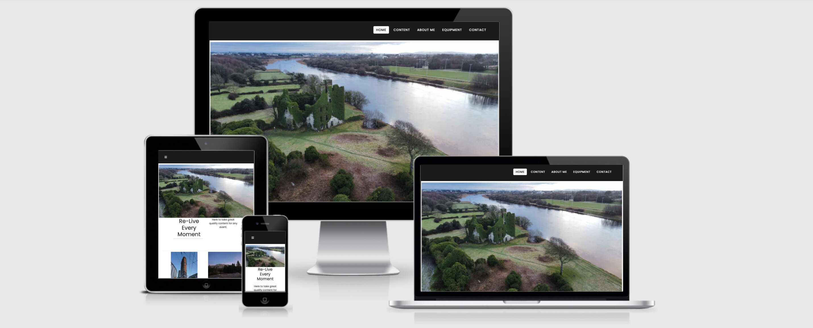
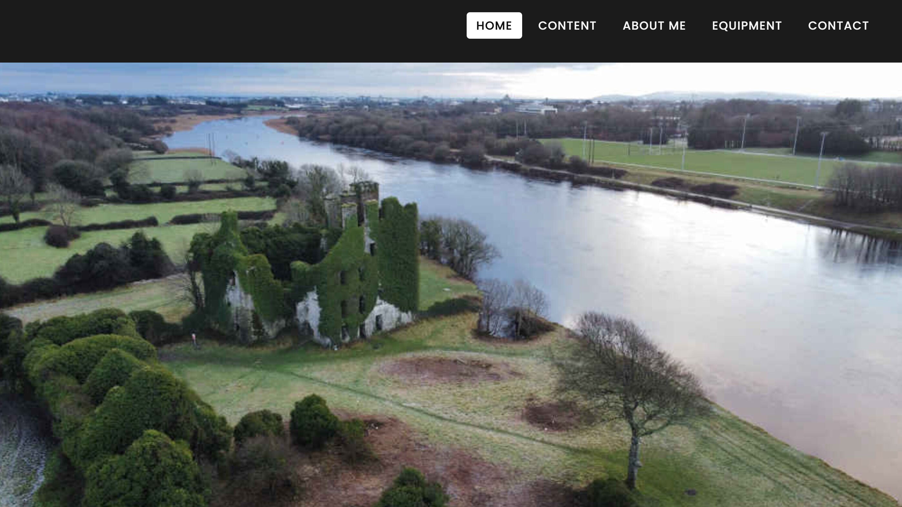

# Eoin Burke Photography 

[View the live project here.](https://eoinburke.github.io/milestone-project/) 

  
The image is from [Am I responsive?](http://ami.responsivedesign.is/)

<light> The main goal behind this was to create a front end responcive website that is user friendly. I designed the website the way I did so everything the user needs to see or use is right in front of them and is easy access.
I picked this particular website because I have a great intrest in content creation and design. I wanted to showcase some of my photos and videos I have shot and edited over the last few years i have been travelling. </light>

# <strong>UX</strong>
I picked this particular website because I have a great intrest in content creation and design. I wanted to showcase some of my photos and videos I have shot and edited over the last few years I have been travelling. I want the user to have everything infront of them so they dont have to be going through diffrent pages. The target audience I am looking for would mostly be models looking for potrait shots and advertising companies who want to advertise a certain location or brand/item.

## <strong>In order for the target audience to achieve these things when visiting my website, I incorporated the following:</strong>
* Easy access and user friendly interface.
* A reponsive nav-bar.
* Responcive photos that can be viewed at a wider scale.
* A sample video I have shot and edited.
* A link to my social media accounts to view more content.

# <strong>Wireframe Mockups</strong>
My mockup wireframs can be found by clicking on the link:
[Github Wireframes](https://github.com/Eoinburke/milestone-project/blob/main/new-project-1.pdf)

# <strong>Website Features</strong>
## [Home](https://eoinburke.github.io/milestone-project/index.html) 
* Narbar - When developing the website I added a sticky navigation bar, I did this to make the website user friendly and easy to navigate through. 
* Image slider - I designed my website with an image slider to grab the users attention, hoping they will want so see more content.
* Modal -  I added modal to my log in/sign up button to make the website that bit more interactive.

## Content
* Fancy box - When I was incorporating images into my webpage I wanted the user to be able to browse through the content freely. Fancy box was the best tool I could use it allows users to play through the images and have easy access to scroll through them.

## More Information
* Video -  Creating this website I wanted to be able to add a section where I could show one of my videos I recorded and edited.

## Social media amd Footer 
* Font awesome icons - I added the font awesome icons to make it easy for the users to access my social media accounts as easy as a click of a button.
* Google maps - I thought the footer looked a little empty so upon further research I found out it wasnt as hard as I thought it woould be to add the map to my footer section.

# Tecnology Used 
* <strong>HTML 5</strong> - I used HTML5 for the basic layout of the website.
* <strong>CSS</strong> - CSS was the used to sty;e the website.
* <strong>[Bootstrap](https://getbootstrap.com/)</strong> - I used Bootstraps code for various things in my website some of which include the nav bar and modal.
* <strong>[Font Awesome](https://fontawesome.com/)</strong> - I incorporated Font Awesome icons in the social media section of my webpage.
* <strong>[Fancy Box](https://fancyapps.com/fancybox/3/)</strong> - Fancy box was very useful in my website. It adds a good layout to the webpage and is very responcive in the way users and scroll through images easily and they can click the play button which will automatically go through the photos for them.
* <strong>[Google Fonts](https://fonts.google.com/)</strong> - I used Google fonts to style the font of font i was using through out the prroject.

# Testing:
Testing information can be found in a separate [TESTING.md](https://turquoise-beetle-fc2e6a8o.ws-eu03.gitpod.io/#/workspace/milestone-project) file
## Devices Used 
* Macbook pro
* iPhone X
* Galaxy Note 3 
* iPad pro

# Project Issues 
* I ran into a few problems when creating the website. I had a problem with the nav bar when loading on a mobile device, the nav bar would take up most of the room over the home page image which looked very unprofessional.
* I have three image slides for my home page but I have couldnt figure out how to get the third one to work unfortunatley so in the end i had to remove it from the final touches to the project.
* I also ran into problems with my images. They were taking too long to process which slowed down the the websites time to load. To overcome this I had to use [Gimp](https://www.gimp.org/) to help re-size and lower the images resolution quality.
* While using Fancy box I found it difficult to get it working properly but with further research into the website and youtube I was able to get it working in the end.

# Credit
* I got the main home screen idead and Font awesome icons from watching Drew Ryans Boot strap website on [Youtube](https://www.youtube.com/watch?v=9cKsq14Kfsw&t=1047s) I also used the CSS he used to style thr home page.
* From researching for a while what was the best way to layout the image gallery I used Fancy box and CSS code which I got from [w3Shool](https://www.w3schools.com/howto/tryit.asp?filename=tryhow_js_image_grid).
* I was able to get the modal code from [Bootstrap](https://getbootstrap.com/docs/4.0/components/modal/).
* On the image slider the second photo of thr bear was taken by Melissa Whellas I got form [Facebook](https://m.facebook.com/photographizemag/photos/a.411511801010/10158406321006011/?type=3&source=48).
* Majority of photos and images used in the project were shot and taken by me Eoin Burke.
* For the video I was able to get the code to help me out from [w3schools](https://www.w3schools.com/html/html5_video.asp).
* The image I used fot the Sony a6400 I got from [Google images](https://www.google.com/url?sa=i&url=https%3A%2F%2Fjosipovic.rs%2Fproizvod%2Feasycover-zastitna-maska-za-sony-a6000-a6300-a6400-crna%2F&psig=AOvVaw1Hr_rpScakx33MFd8u4yf5&ust=1614552941112000&source=images&cd=vfe&ved=0CAIQjRxqFwoTCICJ08aUi-8CFQAAAAAdAAAAABAP)
* I had to get the DJI Mavic Mini photo from [WikiMedia](https://commons.wikimedia.org/wiki/File:DJI_Mavic_Mini_displayed_-_1.jpg).
* For the GoPro image i had to get the photo from [HaveCamera](https://havecamerawilltravel.com/gopro/gopro-hero9-black-batteries/)
* All social media icons were got using [Font-Awesome](https://fontawesome.com/https://fontawesome.com/).
* I got the idea for adding the google maps from watching [Geek-Tutorials](https://www.youtube.com/watch?v=KIC0OK9nKXY) on YouTube

# Acknowledgement
* [Code-Institute](https://codeinstitute.net/all-access-coding-challenge/?utm_term=code%20institute%20dublin&utm_campaign=a%26c_BR_IRL_Code_Institute&utm_source=adwords&utm_medium=ppc&hsa_net=adwords&hsa_tgt=kwd-360431879738&hsa_ad=486298911336&hsa_acc=8983321581&hsa_grp=56427889338&hsa_mt=e&hsa_cam=1378516521&hsa_kw=code%20institute%20dublin&hsa_ver=3&hsa_src=g&gclid=EAIaIQobChMI-_Smu52L7wIVjrrtCh0aNwKbEAAYAyAAEgK5d_D_BwE&gclsrc=aw.ds).
* My mentor Guido Cecilio for taking time out of his day to respond to me and for helping me through out our mentor meetings.
* [Bootstrap](https://getbootstrap.com/) for being a great resorce and help for my project.
* [w3schools](https://www.w3schools.com/) was a fantastic resource overall for helpin me with various parts of my project.
* [W3C Markup Validation Service](https://validator.w3.org/) was very useful to test my HTML and CSS files to make sure there was no errors with my code.

