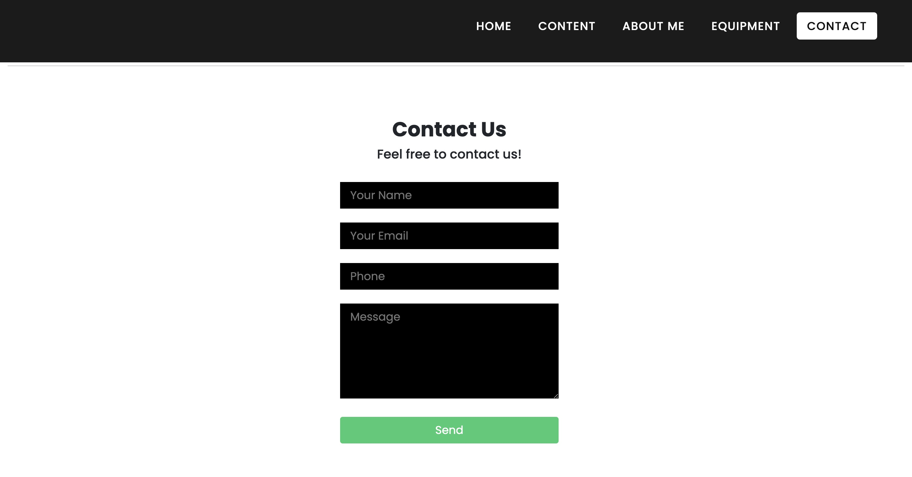
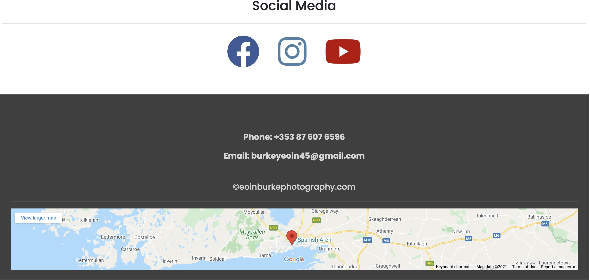

# Testing
1. [**Responsiveness**](#responsiveness)
   - [**Navbar**](#navbar)
   - [**Image**](#image)
   - [**Video**](#video)
   - [**Social Media**](#social-media)
   - [**Footer**](#footer)
2. [**Validator**](#validator)

# Responsiveness
I tested the website across various screen sizes by using the inspect option when I right click on the website. 
## Test 
- Check each page of the website on diffrent screen sizes by using Google dev tools.
## Results
- There were some issues with the website when it was displayed on smaller screen sizes, such as the collapseable nav-bar would not respond.
- There is unnecessary amount of white space on the right hand of the screen.

# Navbar
For the Navbar I decided to go for a dark theme to make it stand out and easier to read, I also choose to use the 'fixed-top' class so it would be easier for the user to navigate through the website.
## Test 
- Make sure each link on the navbar is responsive and working correctly when clicked.
- Test to see if the navbar collapses when displayed on smaller screen sizes.
- Scroll up and down on the website to make sure the navbar is always displayed for easier navigation throughout the webpage.
## Results
- Navbar worked perfectly on laptop screens but failed to preforme when displayed on lower screen sizes the collapseable navbar failed to work correctly.

# Image
As the website is based around photography I wanted to be able to display some photos that would be easy to go through and would be interactive in some way. After doing some research into how I could achive this I came across fancy box.
## Test 
- Make sure all the images are displayed correctly.
- Check to see when a image is clicked that it respods by increasing the images size and all interactive buttons are displayed with it.
- Click the play button on the top right corner of any image and make sure it goes through all photos automatically.
- Ensuring that all other buttons displayed are working correctly.
- Testing to make sure it is fully responsive across smaller devices.
## Results
- Fancy box passed all the tests and was fully working and responsive on all device sizes.

## Video
I wanted to include a video as I also like to edit videos in my spare time, I included this as I want users to be engrossed by the content.
## Test
- Ensure the video loads and plays all the way through with no interruption.
- Test the video on all devise sizes and make sure it is responsive.
- Make sure the full screen button is working perfectly.
- I had to downgrade the video quality by using software called Davinchi Ressolve to ensure the video would not take too long to load but would also keep some of the video quality.
## Results
- The video passed the test throught out all devices and was able to load and play without any buffering.

## Social Media 
Another big part of the website was including interactive font awesome icons that would open up a separate tab and bring the user to my social media websites.
## Test 
- Clicking each font awesome icon and ensuring it opnes up a separate windows tab and opens up thr correct page.
- Using Google dev tools and ensuring the icons are responsive on smaller devices.
## Results
- The font awesome icons passed all the tests.

## Footer 
My footer section was very bare looking so upon looking into what else i could include in it I found out how to add a pin pointed map that would display my location on it.
## Test
- Ensure that the map would be displayed and fully interactive when clicked.
- Make sure the map is responcive and interactive on smaller devices.
## Results
- The map passed all tests.

# Testing client stories from UX section of README.md
1. Header containing the menu bar including Home, Content, About Me, Equipment and Contact.

- The user can navigate through the website using the navbar menu on top of the page.
- The logo links the user back to the Home Page.

2. Content section displaying easy to scroll through photos.

- Interactive and easy to scroll through images.

3. About me section giving a brief introduction about myself.

- 
4. A information section with a video file showing my work in videography.

5. Equipment section displaying the equipment I use.

6. Simple Contact Form.

7. Footer containing links to social media, phone number and email.

# Validator
### HTML
- I tested all my HTML files by using [W3C Markup Validation Service](https://validator.w3.org/) there were 2 bugs that I was unable to fix, I tried using CSS to solve the problem but I was unable to. In the end I had to use the original HTML code as it was the only way I could solve the problem.

### CSS
- I tested all my CSS files by using [W3C Markup Validation Service](https://validator.w3.org/) no errors appeared when I ran the code.

